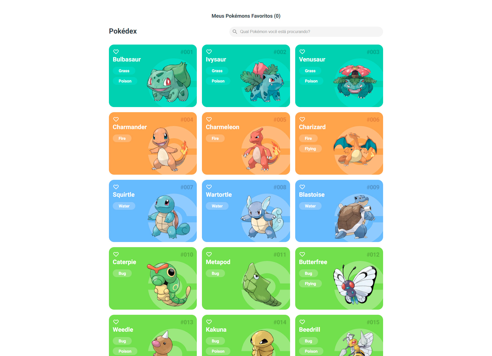

<h1 align="center">
  Pokédex
</h1>

<p align="center">
  <a href="https://pokedex.diegoricardoweb.dev/" target="_blank">
    
  </a>
</p>

## 💻 Projeto

Desenvolvido uma plataforma web para listagem e visualização de pokémons, para a construção deste projeto foi usado ReactJS. Todos os dados sobre os pokémons como nome, número, tipo, imagem e entre outras coisas, foram possíveis com o uso da API REST [PokéApi](https://pokeapi.co/)

Dependências usadas no projeto:

-  [NextJS](https://nextjs.org/)
-  [Styled Components](https://styled-components.com/)
-  [TypeScript](https://www.typescriptlang.org/)
-  [React Icons](https://react-icons.github.io/react-icons/)
-  [React Router](https://v5.reactrouter.com/web/guides/quick-start)
-  [Radix UI](https://www.radix-ui.com/)


Também foi adicionado a ferramenta [**ESLint**](https://eslint.org/) e [**Prettier**](https://prettier.io/) para aumentar a produtividade e auxiliar a manter um padrão de código.

## 📥 Instalação e execução

Faça um clone desse repositório e acesse o diretório.

```bash
# Instalando as dependências
$ yarn

# Executanto aplicação
$ yarn dev
```
Abra [http://localhost:3000](http://localhost:3000) em seu browser para ver o resultado.

## Comandos

- `dev`: roda sua aplicação em `localhost:3000`
- `build`: cria a versão de build de produção
- `lint`: roda os linter em todos os componentes e páginas
